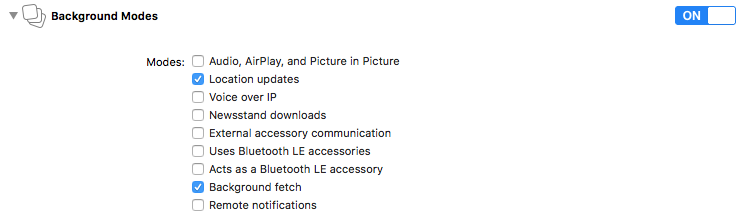
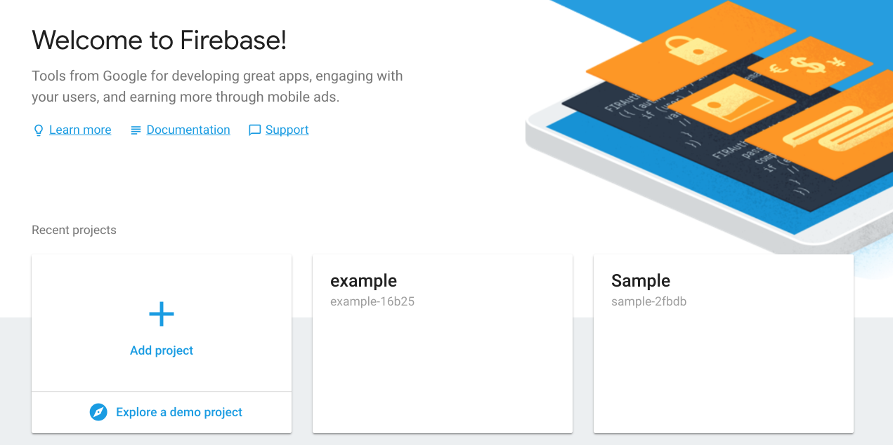
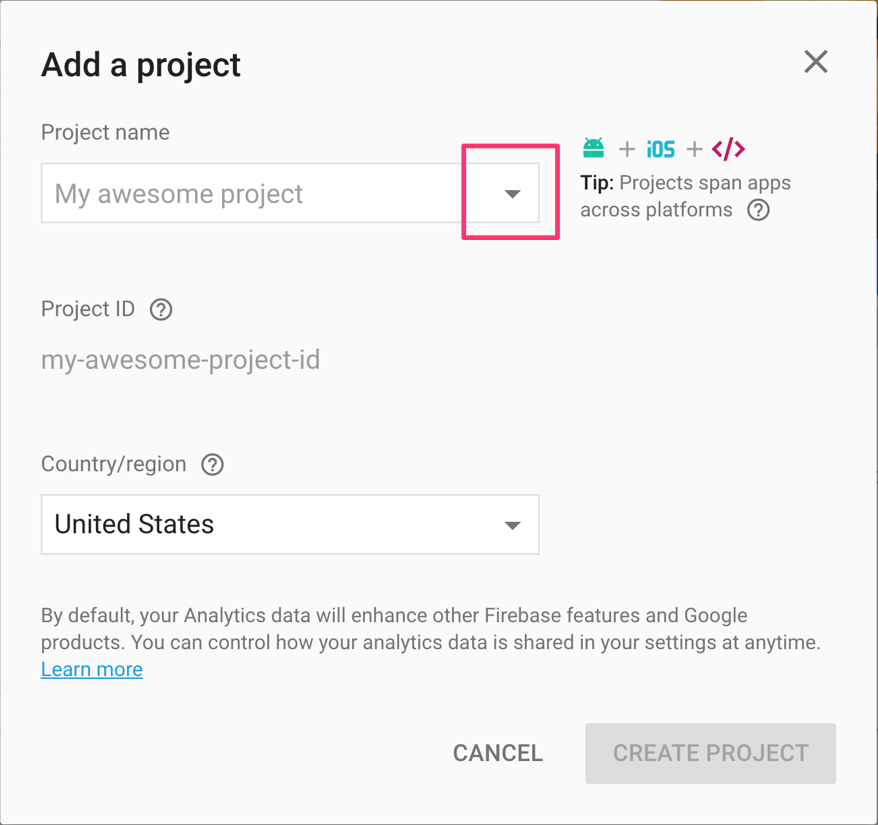
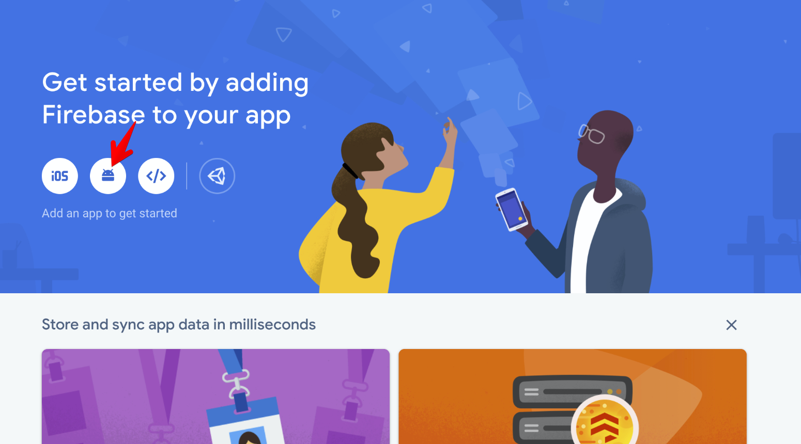

# Curbside Cordova plugin for iOS and Android (version 3.2.3)

This plugin is a wrapper for [Curbside SDK](https://developer.curbside.com/docs/).

---

<a name="quick_install"></a>
## Quick install

_Stable version(npm)_

```bash
cordova plugin add curbside-cordova
```

_Develop version_

```bash
cordova plugin add https://github.com/RakutenReady/curbside-cordova.git
```

### Requirements

- Cordova application which is supporting at least iOS or Android platform.
- USAGE_TOKEN which is unique token that is provided by RakutenReady.

### iOS

***Enable Background Modes***

1. From the Project Navigator, select your project.
2. Select your target.
3. Select Signing and Capabilities.
4. Scroll down to capabitilies section and search for Background Modes capability.
5. If Background Modes capability is not found just add it by clicking + button at the top left.
6. Check Location updates and Background fetch.



Otherwise you will get

```
*** Assertion failure in -[CLLocationManager setAllowsBackgroundLocationUpdates:]
*** Terminating app due to uncaught exception 'NSInternalInconsistencyException', reason: 'Invalid parameter not satisfying: !stayUp || CLClientIsBackgroundable(internal->fClient)'
```

In `platforms/ios/YOUR_PROJECT/Classes/AppDelegate.m`

-   Add on top

```objc
@import Curbside;
```

#### **User Session**

-   At the end of `-(BOOL)application:(UIApplication *)application didFinishLaunchingWithOptions:(NSDictionary *)launchOptions` add this:

```objc
  CSUserSession *userSession = [CSUserSession createSessionWithUsageToken:@"USAGE_TOKEN" delegate:nil];
  [userSession application:application didFinishLaunchingWithOptions:launchOptions];
```

#### **Monitoring Session**

If your app does not already request location, In `platforms/ios/YOUR_PROJECT/Classes/AppDelegate.m` in `-(BOOL)application:(UIApplication *)application didFinishLaunchingWithOptions:(NSDictionary *)launchOptions` add this:

```objc
    CSMonitoringSession *monitoringSession = [CSMonitoringSession createSessionWithAPIKey:@"APIKey" secret:@"secret" delegate:nil];
    [monitoringSession application:application didFinishLaunchingWithOptions:launchOptions];
```

#### **Configuration**

You can also configure the following variables to customize the iOS location plist entries

  <config-file target="*-Info.plist" parent="NSLocationAlwaysAndWhenInUseUsageDescription">
            <string>$LOCATION_ALWAYS_AND_WHEN_IN_USE_USAGE_DESCRIPTION</string>
        </config-file>
        <config-file target="*-Info.plist" parent="NSLocationWhenInUseUsageDescription">
            <string>$LOCATION_WHEN_IN_USE_DESCRIPTION</string>
        </config-file>
        <config-file target="*-Info.plist" parent="NSLocationUsageDescription">
            <string>$LOCATION_USAGE_DESCRIPTION</string>
        </config-file>
      
-   `LOCATION_ALWAYS_AND_WHEN_IN_USE_USAGE_DESCRIPTION` for `NSLocationAlwaysAndWhenInUseUsageDescription` (defaults to "To get accurate GPS
    locations")
-   `LOCATION_WHEN_IN_USE_DESCRIPTION` for `NSLocationWhenInUseUsageDescription` (defaults to "To get accurate GPS locations")
-   `LOCATION_USAGE_DESCRIPTION` for `NSLocationUsageDescription` (defaults to "To get accurate GPS locations")


Example using the Cordova CLI

```bash
cordova plugin add curbside-cordova \
    --variable LOCATION_ALWAYS_AND_WHEN_IN_USE_USAGE_DESCRIPTION="My custom always usage message" \
    --variable LOCATION_WHEN_IN_USE_DESCRIPTION="My custom when in use message" \
    --variable LOCATION_USAGE_DESCRIPTION="My custom usage message"
```

Example using config.xml

```xml
<plugin name="curbside-cordova" spec="3.0.0">
    <variable name="LOCATION_ALWAYS_AND_WHEN_IN_USE_USAGE_DESCRIPTION" value="My custom always usage message" />
    <variable name="LOCATION_WHEN_IN_USE_DESCRIPTION" value="My custom when in use message" />
    <variable name="LOCATION_USAGE_DESCRIPTION" value="My custom usage message" />
</plugin>
```

### Android

Add the Curbside SDK maven url

In your project, edit the file `platforms/android/build.gradle`.

Replace

```java
allprojects {
    repositories {
        google()
        jcenter()
    }
}
```

by:

```java
allprojects {
    repositories {
        google()
        jcenter()
        maven {
            url "https://maven.google.com"
        }
        maven {url "https://raw.github.com/Curbside/curbside-android-sdk-release/master"}
    }
}
```

Otherwise, you will experience the following error:

```
* What went wrong: A problem occurred configuring root project 'android'.
  > Could not resolve all dependencies for configuration ':_debugApkCopy'. Could not find any matches for
  > com.curbside:sdk:3.0+ as no versions of com.curbside:sdk are available.
       Required by:
           project :
```

#### **Add Firebase in your app**

1. Go to <a href="https://console.firebase.google.com/u/0/">Firebase Console</a> and click **Add project**.



2. Following pop up window will open. Click on the drop down marker in front of Project Name. Select the project from the list of existing Google Projects and then click “Add Firebase”.



3. Click **Add Firebase to your Android app** and follow the setup steps.



4. When prompted, enter your app's package name (i.e.: 'PACKAGE_NAME' Json property of your Android application). Package name can only be set when you add an app to your Firebase project on the Firebase web page.
5. At the end, you'll download a google-services.json file. You can download this file again at any time.
6. Copy google-services.json file into your project's module folder, typically app.
7. Follow the instructions to add the Firebase SDK in your Android app.


8. **Make sure** that all the google dependencies are of the same version. Otherwise, app may throw errors/exceptions when running/syncing the project.

#### **Setup your MainActivity**

In `platforms/android/app/src/main/java/io/cordova/YOUR_PROJECT/MainActivity.java` add your usage token and permission notification:

```java
    import android.content.pm.PackageManager;
    import android.Manifest;
    import androidx.core.app.ActivityCompat;
    import com.curbside.sdk.credentialprovider.TokenCurbsideCredentialProvider;
    import com.curbside.sdk.CSUserSession;

    public class MainActivity extends CordovaActivity
    {
      private static String USAGE_TOKEN = "USAGE_TOKEN";
      private static final int PERMISSION_REQUEST_CODE = 1;

      @Override
      public void onCreate(final Bundle savedInstanceState) {
          super.onCreate(savedInstanceState);
          CSUserSession.init(this, new TokenCurbsideCredentialProvider(USAGE_TOKEN));

          if (ActivityCompat.checkSelfPermission(this, Manifest.permission.ACCESS_FINE_LOCATION) != PackageManager.PERMISSION_GRANTED &&
                  ActivityCompat.checkSelfPermission(this, Manifest.permission.ACCESS_COARSE_LOCATION) != PackageManager.PERMISSION_GRANTED) {
              String[] permissions = new String[]{Manifest.permission.ACCESS_COARSE_LOCATION, Manifest.permission.ACCESS_FINE_LOCATION};
              ActivityCompat.requestPermissions(this, permissions, PERMISSION_REQUEST_CODE);
          }
        ...
```

or if you whant to have the monitoring session

```java
    public class MainActivity extends CordovaActivity
    {
      private static String API_KEY = "API_KEY";
      private static String SECRET = "SECRET";
      private static final int PERMISSION_REQUEST_CODE = 1;

      @Override
      public void onCreate(final Bundle savedInstanceState) {
          super.onCreate(savedInstanceState);

          CSMonitoringSession.init(this, new BasicAuthCurbsideCredentialProvider(API_KEY, SECRET));

          if (ActivityCompat.checkSelfPermission(this, Manifest.permission.ACCESS_FINE_LOCATION) != PackageManager.PERMISSION_GRANTED &&
                  ActivityCompat.checkSelfPermission(this, Manifest.permission.ACCESS_COARSE_LOCATION) != PackageManager.PERMISSION_GRANTED) {
              String[] permissions = new String[]{Manifest.permission.ACCESS_COARSE_LOCATION, Manifest.permission.ACCESS_FINE_LOCATION};
              ActivityCompat.requestPermissions(this, permissions, PERMISSION_REQUEST_CODE);
          }
        ...
```

In `platforms/android/cordova/lib/config/GradlePropertiesParser.js` turned on useAndroidX:

```js
'android.useAndroidX': 'true',
'android.enableJetifier': 'true'
```

## Quick Testing

The **curbside-cordova** plugin also contains a **curbside-cordova-tests** plugin that can be used to quickly test if the **curbside-cordova** plugin is working properly and if the installation was done correctly. 

### Create Cordova Test App And Install Plugins

To do the testing you first needs to create a cordova application and install the required plugin as follows: 

```bash
cordova create mytestapp
cd ./mytestapp
cordova platform add android
cordova platform add ios
#Currently geolocation plugin and its test plugin are required because curbside-cordova plugin is not able to display the location authorization dialog (known issue).
cordova plugin add cordova-plugin-geolocation
cordova plugin add ./plugins/cordova-plugin-geolocation/tests
#--------------------------

cordova plugin add cordova-plugin-test-framework
cordova plugin add curbside-cordova
cordova plugin add ./plugins/curbside-cordova/tests
```

After that in [cordova-app-location]/config.xml you need to replace:

```html
<content src="index.html" />
```
by

```html
<content src="cdvtests/index.html" />
```

Finally follow the [Quick Install](#quick_install) to ensure Curbside-Cordova is working properly.

Note that you can use your current Cordova application to do the testing. 


### Running Automatic And Manual Tests

The **curbside-cordova-tests** plugin contains automatic tests and manual tests. It is recommended to first run the automatic tests so that the **cordova-plugin-geolocation-tests** are run first thus triggering the location authorization dialog to prompt the user to give access to mobile device location. 


It is important to allow the Cordova application to have access to location so that starting a curbside trip works successfully. 

Once it is done the manual tests available in **curbside-cordova-tests** plugin can be tested. Those tests involve clicking on buttons to do such a thing as starting a curbside trip and completing/cancelling a trip or all opened trips.


## Quick Start

### For User Session

```html
<script type="text/javascript">
document.addEventListener("deviceready", function() {
  /**
   * Will be triggered when the user is near a site where the associate can be notified of the user arrival.
   **/
  Curbside.on("canNotifyMonitoringSessionUserAtSite", function(site){
    // Do something
  });

  /**
   * Will be triggered when an trip is started for a site.
   **/
  Curbside.on("tripStartedForSite", function(site){
    // Do something
  });

  /**
   * Will be triggered when the user is approaching a site which is currently tracked for a trip.
   **/
  Curbside.on("userApproachingSite", function(site){
    // Do something
  });

  /**
   * Will be triggered when the user has arrived at a site which is currently tracked for a trip.
   **/
  Curbside.on("userArrivedAtSite", function(site){
    // Do something
  });

  /**
   * Will be triggered when an error is encountered.
   **/
  Curbside.on("encounteredError", function(error){
    // Do something
  });

  /**
   * Will be triggered when trackedSites are updated.
   **/
  Curbside.on("updatedTrackedSites", function(sites){
    // Do something
  });

  /**
   * Set the "USER_UNIQUE_TRACKING_ID" of the user currently logged in your app. This may be nil when the app is
   * started, but as the user logs into the app, make sure this value is set. trackingIdentifier needs to be set to use
   * session specific methods for starting trips or monitoring sites. This identifier will be persisted across
   * application restarts.
   *
   * When the user logs out, set this to nil, which will in turn end the user session or monitoring session.
   * Note: The maximum length of the trackingIdentifier is 36 characters.
   **/
  Curbside.setTrackingIdentifier("USER_UNIQUE_TRACKING_ID", function(error){

  });

  /**
   * Start a trip tracking the user pickup of "UNIQUE_TRACK_TOKEN" to the site identified by the "SITE_ID". Call this
   * method when the application thinks its appropriate to start tracking the user eg. Order is ready to be picked up at
   * the site. This information is persisted across relaunch.
   *
   * If an error occurs because of an invalid session state, permissions or authentication with the ARRIVE server,
   * the callback will be informed with the reason as to why startTripToSiteWithIdentifier failed.
   **/
  Curbside.startTripToSiteWithIdentifier("SITE_ID", "UNIQUE_TRACK_TOKEN", function(error){

  });

  /**
   * Start a trip tracking the user pickup of "UNIQUE_TRACK_TOKEN" to the site identified by the "SITE_ID". Call this
   * method when the application thinks its appropriate to start tracking the user eg. Order is ready to be picked up at
   * the site. This information is persisted across relaunch. toDate can be null.
   *
   * If an error occurs because of an invalid session state, permissions or authentication with the ARRIVE server,
   * the callback will be informed with the reason as to why startTripToSiteWithIdentifier failed.
   **/
  Curbside.startTripToSiteWithIdentifierAndEta("SITE_ID", "UNIQUE_TRACK_TOKEN", fromDate, toDate, function(error){

  });


  /**
   * Completes the trip for the user to the site identified by the "SITE_ID" with the given "UNIQUE_TRACK_TOKEN".
   * If no trackToken is specified, then *all* trips to this site  will be completed.
   *
   * Note: Do not call this when the user logs out, instead set the "USER_UNIQUE_TRACKING_ID" to nil when the user logs out.
   **/
  Curbside.completeTripToSiteWithIdentifier("SITE_ID", "UNIQUE_TRACK_TOKEN", function(error){

  });

  /**
   * This method would complete all trips for this user across all devices.
   *
   * Note: Do not call this when the user logs out, instead set the "USER_UNIQUE_TRACKING_ID" to nil when the user logs
   * out.
   **/
  curbside.completeAllTrips(function(error){

  });

  /**
   * Cancels the trip for the user to the given site identified by the "SITE_ID" with the given "UNIQUE_TRACK_TOKEN".
   *
   * If no "UNIQUE_TRACK_TOKEN" is set, then *ALL* trips to this site are cancelled.
   *
   * Note: Do not call this when the user logs out, instead set the "USER_UNIQUE_TRACKING_ID" to nil when the user logs out.
   **/
  Curbside.cancelTripToSiteWithIdentifier("SITE_ID", "UNIQUE_TRACK_TOKEN", function(error){

  });

  /**
   * Returns the "USER_UNIQUE_TRACKING_ID" of the currently tracked user.
   **/
  Curbside.getTrackingIdentifier(function(error, trackingIdentifier){

  });

  /**
   * Returns the list of sites currently tracked by the user.
   **/
  Curbside.getTrackedSites(function(error, sites){

  });

  /**
   * Set userInfo e.g. full name, email and sms number
   **/
  Curbside.setUserInfo({fullName, emailAddress, smsNumber}, function(error){

  });

  /**
   * This method will calculate the estimated time in second of arrival to a site.
   * Negative value means ETA is unknown.
   */
  Curbside.getEtaToSiteWithIdentifier("SITE_ID", {
      latitude,
      longitude,
      altitude,
      speed,
      course,
      verticalAccuracy,
      horizontalAccuracy
    }, "driving", function(error, eta){
});
</script>
```

### For Monitoring Session

```html
<script type="text/javascript">
document.addEventListener("deviceready", function() {
   /**
   * Will be triggered when user status updates are sent to the consuming application.
   **/
  Curbside.on("userStatusUpdates", function(UserStatusUpdates){
    // Do something
  });

  /**
   * Set the "USER_UNIQUE_TRACKING_ID" of the user currently logged in your app. This may be nil when the app is
   * started, but as the user logs into the app, make sure this value is set. trackingIdentifier needs to be set to use
   * session specific methods for starting trips or monitoring sites. This identifier will be persisted across
   * application restarts.
   *
   * When the user logs out, set this to nil, which will in turn end the user session or monitoring session.
   * Note: The maximum length of the trackingIdentifier is 36 characters.
   **/
  Curbside.setTrackingIdentifier("USER_UNIQUE_TRACKING_ID", function(error){

  });

  /**
   * Returns the "USER_UNIQUE_TRACKING_ID" of the currently tracked user.
   **/
  Curbside.getTrackingIdentifier(function(error, trackingIdentifier){

  });

  /**
   * Completes the trip(s) identified by the trackToken(s) and trackIdentifier to this site.
   * Call this method when the trip(s) for the given trackToken(s) is/are completed by the user.
   * If the trackTokens is nil, then all trips to this site for the user will be marked complete.
   **/
  Curbside.completeTripForTrackingIdentifier("USER_UNIQUE_TRACKING_ID", ["UNIQUE_TRACK_TOKEN_1", "UNIQUE_TRACK_TOKEN_2"], function(error){

  });

  /**
   * Cancels the trip(s) identified by the trackToken(s) and trackIdentifier to this site.
   * Call this method when the trip(s) for the given trackToken(s) is/are cancelled by the user.
   * If the trackTokens is nil, then all trips to this site for the user will be canceled.
   **/
  Curbside.cancelTripForTrackingIdentifier("USER_UNIQUE_TRACKING_ID", ["UNIQUE_TRACK_TOKEN_1", "UNIQUE_TRACK_TOKEN_2"], function(error){

  });

  /**
   * This subscribes to user arrival and status updates to the site defined by arrivalSite.
   * If an error occurs because of an invalid session state, permissions or authentication with the ARRIVE server,
   * Will trigger userStatusUpdates
   **/
  Curbside.startMonitoringArrivalsToSiteWithIdentifier("SITE_ID", function(error){

  });

  /**
   * This unsubscribes to user status updates.
   **/
  Curbside.stopMonitoringArrivals(function(error){

  });
});
</script>
```

### Promise

All functions return a Promise as an alternative to a callback.

-   setTrackingIdentifier
-   startTripToSiteWithIdentifier
-   startTripToSiteWithIdentifierAndEta
-   completeTripToSiteWithIdentifier
-   completeAllTrips
-   cancelTripToSiteWithIdentifier
-   getTrackingIdentifier
-   getTrackedSites
-   getEtaToSiteWithIdentifier

The Promise can be used like this:

```js
Curbside.getTrackedSites
    .then(function(sites) {
        // Do something
    })
    .catch(function(error) {
        // Do something
    });
```
