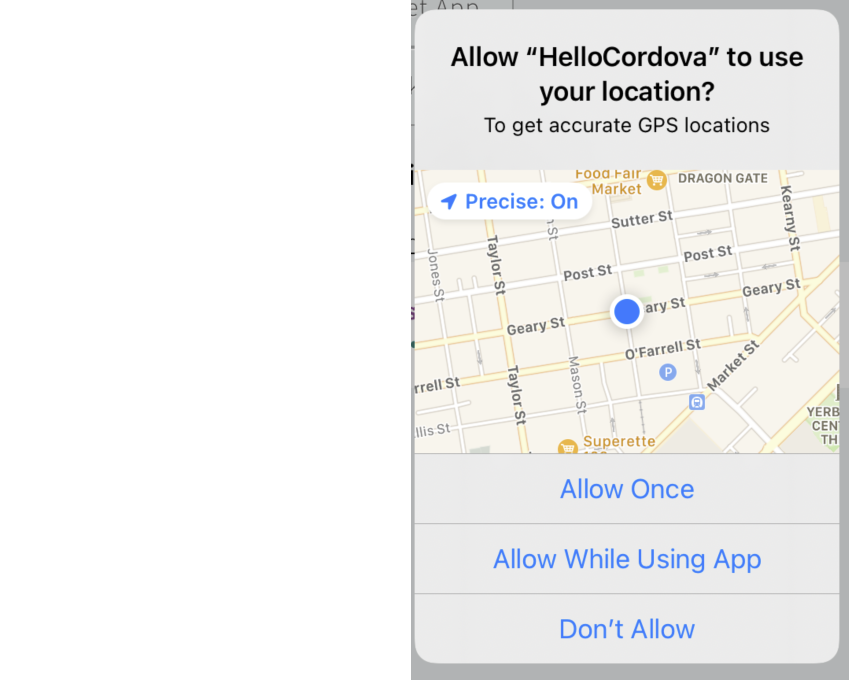

# Curbside Cordova Plugin Development Instruction

This readme contains information for development purpose only and should **NOT** be publish to the clients (i.e.: keep listed in .npmignore file. 

## Quick Testing

The **curbside-cordova** plugin also contains a **curbside-cordova-tests** plugin that can be used to quickly test if the **curbside-cordova** plugin is working properly and if the installation was done correctly. 

### Create Cordova Test App And Install Plugins

To do the testing you first needs to create a cordova application and install the required plugin as follows: 

```bash
cordova create mytestapp
cd ./mytestapp
cordova platform add android
cordova platform add ios
#Currently geolocation plugin and its test plugin are required because curbside-cordova plugin is not able to display the location authorization dialog (known issue).
cordova plugin add cordova-plugin-geolocation
cordova plugin add ./plugins/cordova-plugin-geolocation/tests
#--------------------------

cordova plugin add cordova-plugin-test-framework
cordova plugin add curbside-cordova
cordova plugin add ./plugins/curbside-cordova/tests
```

After that in [cordova-app-location]/config.xml you need to replace:

```html
<content src="index.html" />
```
by

```html
<content src="cdvtests/index.html" />
```

Finally follow the **Quick Install** section in README.md to ensure Curbside-Cordova is working properly. 

Note that when doing Android installation the package name in  mytestapp/platforms/android/app/google-services.json should be the following: 

```json
"package_name": "io.cordova.hellocordova"
```

### Running Automatic And Manual Tests

The **curbside-cordova-tests** plugin contains automatic tests and manual tests. It is recommended to first run the automatic tests so that the **cordova-plugin-geolocation-tests** are run first thus triggering the location authorization dialog to prompt the user to give access to mobile device location. 



It is important to allow the Cordova application to have access to location so that starting a curbside trip works successfully. 

Once it is done the manual tests available in **curbside-cordova-tests** plugin can be tested. Those tests involve clicking on buttons to do such a thing as starting a curbside trip and completing/cancelling a trip or all opened trips.

## Releasing New Plugin

The release involved the following step: 

### 1. Update the plugin version

The version of the cordova-plugin should be upgrade in the following files : 

```
./package-lock.json
./package.json
./plugin.xml
```
Here is an PR example on how to do it : https://github.com/RakutenReady/curbside-cordova/pull/23/files


### 2. Login to Curbside npm account

Run the following command: 

```
npm login
```

**username**: curbside
**password**: Use the password found in Eng json bundle in **curbside-devops**


### 3. Do the packaging

Run the following command: 

```
npm pack
```
Ensure that there are no file/directory listed by the packaging command that must **NOT** be published. If such file/directory exists add them to **./.npmignore** file and rerun the packaging.

### 4. Publish the new package

Run the following command: 

```
npm publish
```

Once this is done check if the published version of the curbside-cordova plugin on the [npmjs page](https://www.npmjs.com/search?q=curbside
) is the one should published.

